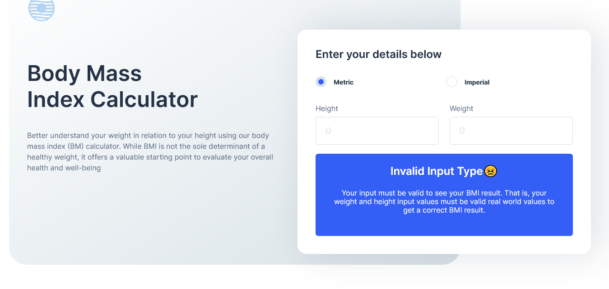

# Frontend Mentor - Body Mass Index Calculator solution

This is a solution to the [Body Mass Index Calculator challenge on Frontend Mentor](https://www.frontendmentor.io/challenges/body-mass-index-calculator-brrBkfSz1T). Frontend Mentor challenges help you improve your coding skills by building realistic projects.

## Table of contents

- [Overview](#overview)
  - [The challenge](#the-challenge)
  - [Screenshot](#screenshot)
  - [Links](#links)
- [My process](#my-process)
  - [Built with](#built-with)
  - [What I learned](#what-i-learned)
  - [Continued development](#continued-development)
  - [Useful resources](#useful-resources)
- [Author](#author)

### The challenge

Users should be able to:

- Select whether they want to use metric or imperial units
- Enter their height and weight
- See their BMI result, with their weight classification and healthy weight range
- View the optimal layout for the interface depending on their device's screen size
- See hover and focus states for all interactive elements on the page

### Screenshot

### Links

- Solution URL: [My Solution](https://github.com/shadowwalker415/BMI_Index_Calculator)
- Live Site URL: [Live Site](https://your-live-site-url.com)

## My process

I used a top to bottom approach to complete the challenge. I started from the mockup and styling of the top most components, and after that I continued with the mockup and styling of the bottom sections of the project. However, I left out some of the styling and even the responsiveness of the app for the later part of the process. I then wrote the JavaScript for the BMI Index calculation functionality since most of the radio button interactivity was already done with Sass. I created seperate JavaScript files for there different views to be rendered dynamically when the radio buttons are checked and when the user submits the input entered in the input forms. Then one main JavaScript file "index.js" used as the control to handle the events of these different views. This was more of like using the MVC pattern but without the model where the state of the application resides. Lastly, the was a "helper.js" JavaScript file which was were all the functions for calculating the metric units, imperial units and getting the ideal weight ranges for both measurement units resided.

### Built with

- Semantic HTML5 markup
- CSS
- Flexbox
- CSS Grid
- [Sass](https://sass-lang.com/) - CSS preprocessor
- JavaScript

### What I learned

While working on this project, I learned how to listen to events on dynamically rendered HTML elements using event delegation techniques. I also learned some DOM travesal methods which I believe will be valuable as I continue my journey.
These for me, were there most valuable things I learned working on this challenge, because most of there other parts of my solution to this challenge were concepts and techniques I was already familiar with.

### Continued development

I plan on improving my CSS & Sass skills to an advanced level by learning more on animations, responsiveness and accessibility. I am not a big fan of CSS frameworks like Bootstrap or Tailwin, in as much as they're great tools for improving development speed. I have always loved being confident and being able to not only explain what's going on in my code, but also to have full confidence in teaching it to others who might have just started learning. Moving forward I would also love to learn a JavaScript framework like ReactJs. However, this is just a tip of the iceberg as my main goal is to learn as many computer science concepts and programming languages as possible to become a software engineer.

### Useful resources

- [ChatGPT](https://chat.openai.com) - ChatGPT helped me understand why I was getting error messages whenever I was trying to select or target HTML elements that were rendered dynamically. With ChatGPT I learned some few techniques on DOM traversal and targeting dynimcally rendered HTML elements using event delegation. I will use this tool as much as possible going forward with my learning journey.

## Author

- Website - [John Kwo Nkwelle](https://johnnkwelle.netlify.app)
- Frontend Mentor - [@shadowwalker415](https://www.frontendmentor.io/profile/shadowwalker415)
- Twitter - [@shadowwalker415](https://twitter.com/shadowwalker415)
